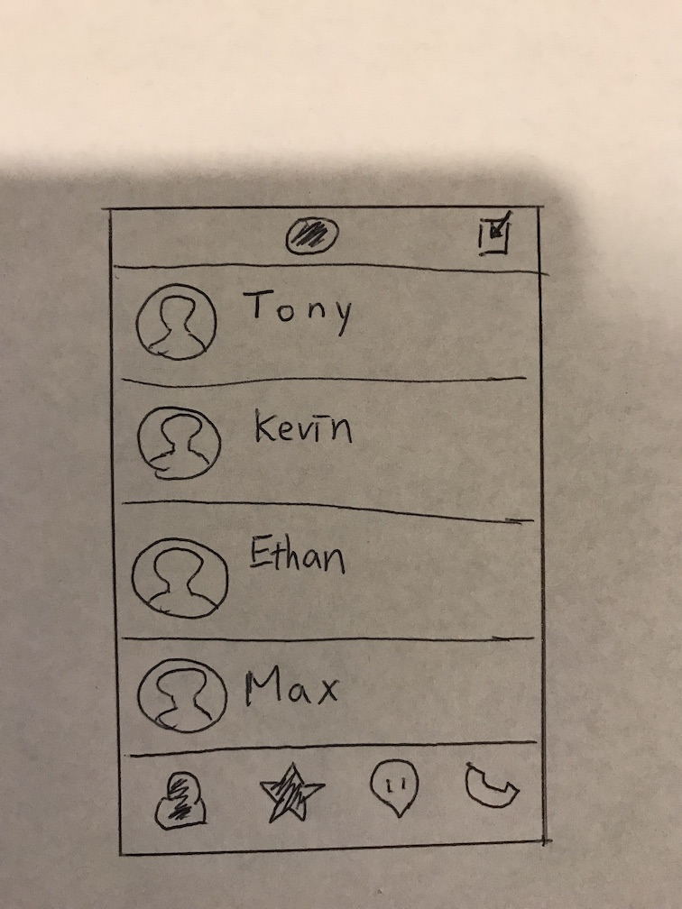
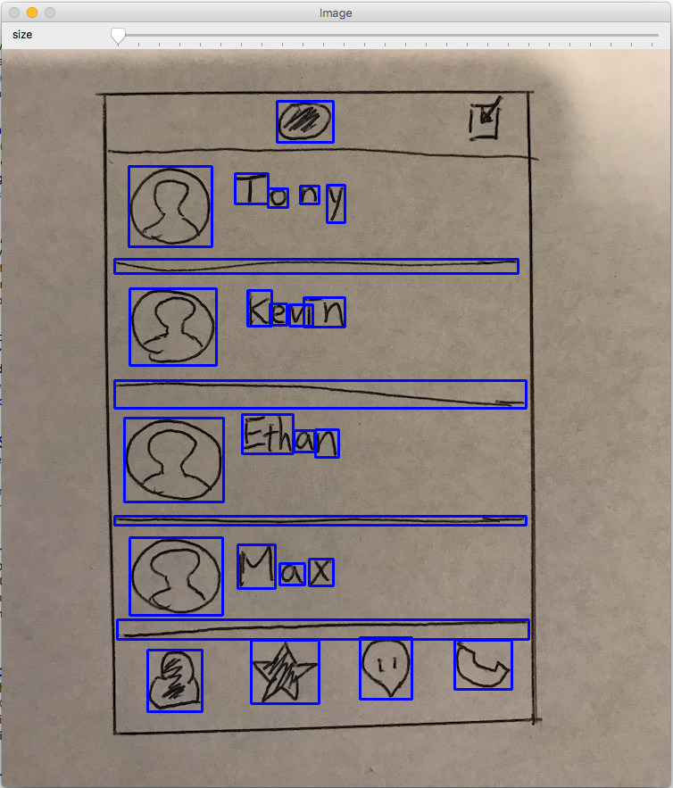
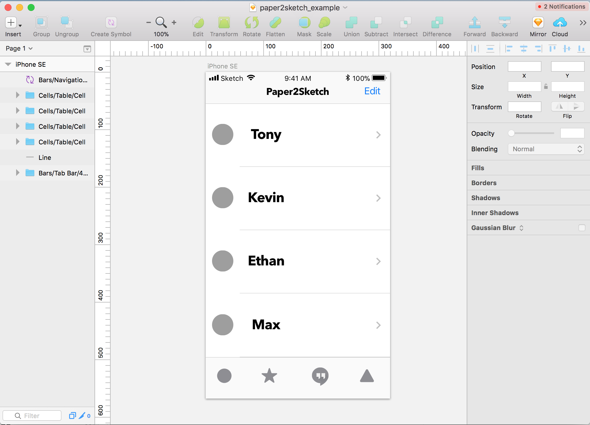

# Paper2Sketch
## Introduction
> During mobile/web app development, paper prototyping is always the essential process to enable rapid prototyping and team communication since it's easy and fast. Designers are required to mock up or design high-fidelity sketches based on the latest result of the paper prototype from scratch. The project is to provide designers a tool to transform their paper prototype into sketch files rapidly, so it can speed up the development process.

## Concept: paper sketch to design files
1. Your Paper Sketch

2. Run Paper2Sketch

3. Generated Sketch files

## Current Stage
Currently, I wrote up a python script to test some classic CV algorithms to see whether we can identify positions of potential UI elements in the paper sketch. According to results shown above, the result is quite interesting since we haven't tested with other further ML or DL stuff. Based on the initial result, we can at least build up the basic UI layout from the paper sketch.

## Next Steps
1. Identify potential text area by combining contours that are close to each other horizontally.
2. Implement an mobile app to capture and analyze paper sketches.
3. Implement a Sketch plugin to read the extracted info from the mobile app to generate the Sketch file with the basic layout from extracted infos.
4. Apply ML to identify the specific UI component, so our plugin can apply our default design to the component to start with a design sketch with higher fidelity.
